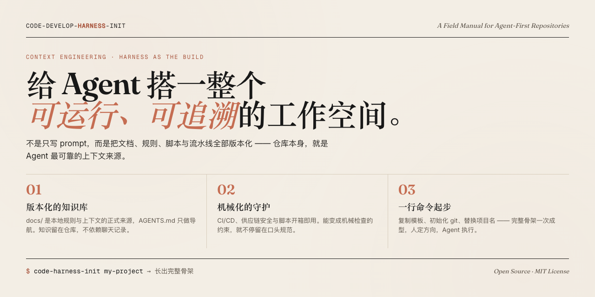
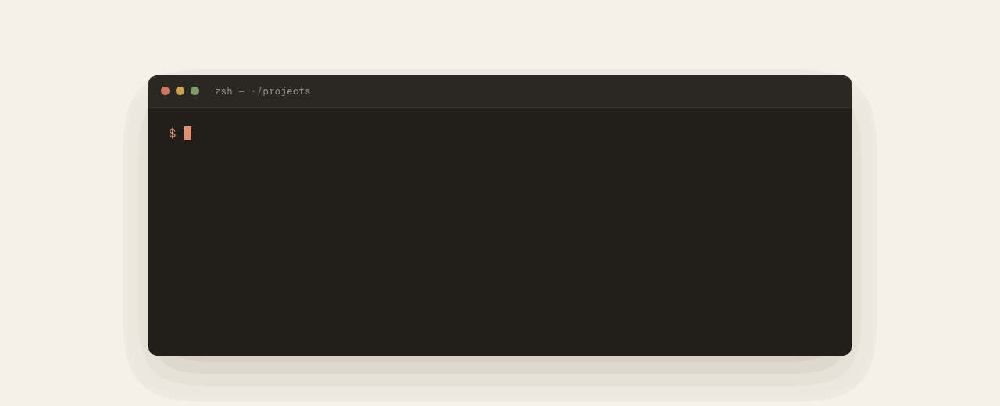
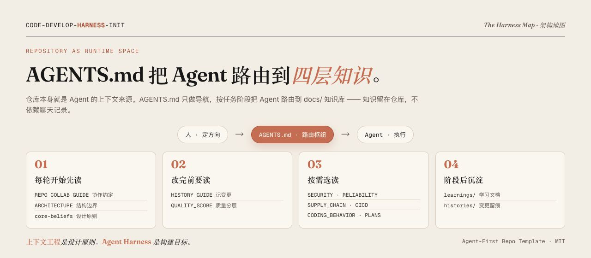

<!-- <p align="center">
  
</p> -->

<h1 align="center">code-develop-harness-init</h1>

<p align="center">
  面向 Agent-first 开发的项目初始化模板（Harness）—— 人定方向，Agent 执行；开发者通过对话推进项目，而不是手动编码。开箱即用的仓库骨架、CI/CD 流水线、文档体系与供应链安全能力。
</p>

<p align="center">
  <a href="#快速开始"></a>
  <a href="LICENSE"></a>
  
</p>

## 背景

> **上下文工程是设计原则，Agent Harness 是构建目标。**

不是只给 Agent 写 prompt，而是给它搭一整个**可运行、可追溯**的工作空间——孤立的一句 prompt 撑不起协作，被文档、规则、CI 与脚本包裹的运行空间才行。

<p align="center">
  
</p>

核心理念：

- 为 Agent 搭建完整的运行空间，而不是只写 prompt。
- 仓库本身就是 Agent 的上下文来源——文档、规则、脚本都版本化管理。
- 人定方向，Agent 执行——开发者通过对话驱动项目，不需要手动进入代码库编码；知识留在仓库里，不依赖聊天记录。

## 快速开始

一行命令，长出完整骨架：

<p align="center">
  
</p>

### 安装（一次性）

```sh
git clone <你的仓库地址> ~/harness-template
cd ~/harness-template
npm link
```

完成后 `code-harness-init` 命令即全局可用。

### 创建新项目

```sh
# 在当前目录下创建新项目
code-harness-init my-project

# 指定目标目录
code-harness-init my-project ~/projects
```

脚本会自动完成：复制模板文件、初始化 git 仓库、替换项目名称。

### 创建后的下一步

```sh
cd my-project
npm run ci                          # 验证仓库完整性
# 编辑 docs/ARCHITECTURE.md         — 补齐真实项目架构
# 编辑 CODEOWNERS                   — 替换为真实的代码所有者
git add -A && git commit -m 'init'  # 创建初始提交
```

## 架构地图

仓库本身就是 Agent 的上下文来源：`AGENTS.md` 只做导航、把 Agent 路由到 `docs/` 知识库；CI 把约束变成机械检查；`histories/` 让每一步可追溯。

<p align="center">
  
</p>

## 仓库内开发

```sh
npm run ci              # 运行全部 CI 检查
npm run check:docs      # 仅检查文档骨架
npm run check:repo      # 仅检查仓库基础卫生
npm run check:actions   # 仅检查 GitHub Actions SHA 固定
npm run release-package # 打包 release 制品
```

## 仓库结构

```text
.
├── AGENTS.md                  # Agent 入口，文档路由
├── CONTRIBUTING.md            # 协作约定
├── docs/                      # 仓库知识库
│   ├── ARCHITECTURE.md        # 架构总览
│   ├── CICD.md                # CI/CD 说明
│   ├── CODING_BEHAVIOR.md     # 编码行为纪律
│   ├── RELIABILITY.md         # 稳定性与可运维性
│   ├── SECURITY.md            # 安全默认约束
│   ├── design-docs/           # 设计文档
│   ├── exec-plans/            # 执行计划
│   ├── histories/             # 变更历史
│   ├── learnings/             # 学习文档
│   ├── media/                 # README 视觉素材（头图 / 动图 / 信息图）
│   └── releases/              # 发布记录
├── scripts/                   # 自动化脚本
│   ├── ci.sh                  # CI 入口
│   ├── create-project.sh      # 项目创建（harness-init）
│   └── release-package.sh     # Release 打包
└── .github/                   # GitHub Actions 和模板
    └── workflows/             # CI、Release、供应链安全
```

## 参考与致谢

- [harness-template](https://github.com/iFurySt/harness-template) / [harness-template-cn](https://github.com/iFurySt/harness-template-cn) — Agent-first 仓库模板的原始实现，本项目的基础骨架来源。
- [上下文工程与运行空间实践指南](https://github.com/WakeUp-Jin/Practical-Guide-to-Context-Engineering) — 从上下文工程到 Harness Engineering 的系统化方法论，本项目的理论参考。
- [Linux.Do 社区](https://linux.do/latest) (真诚 、友善 、团结 、专业)


## 许可证

[MIT](LICENSE)
